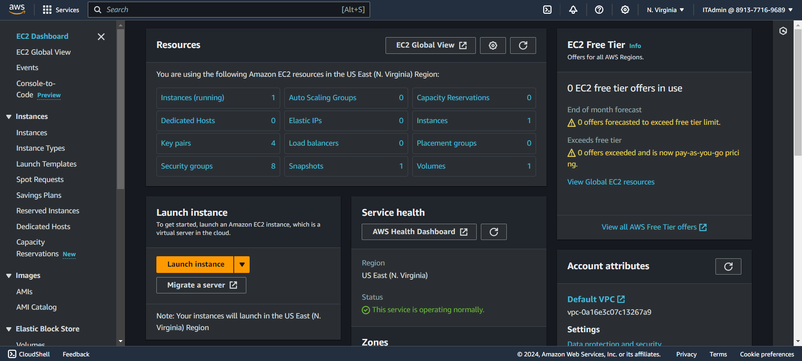
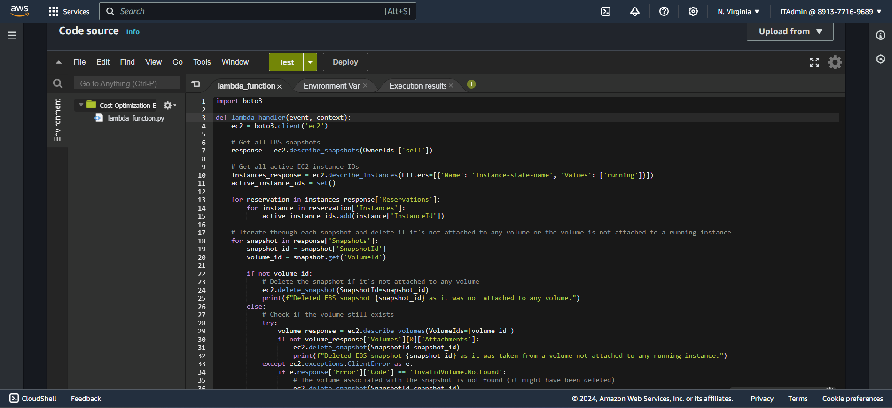
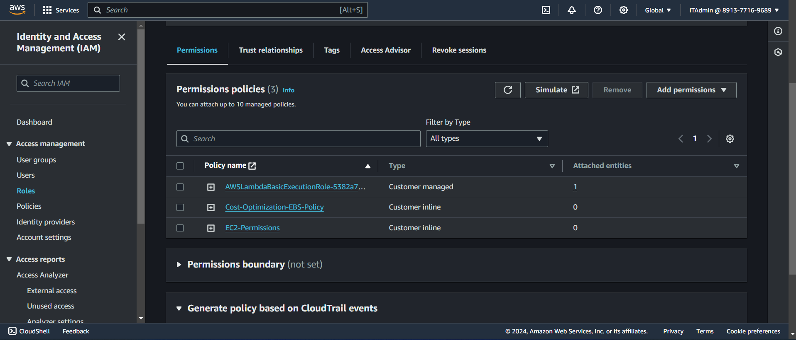
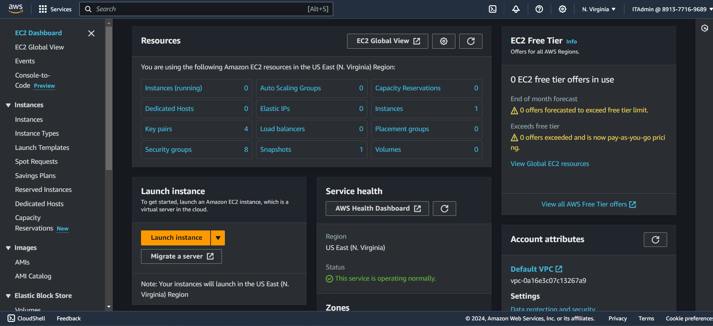
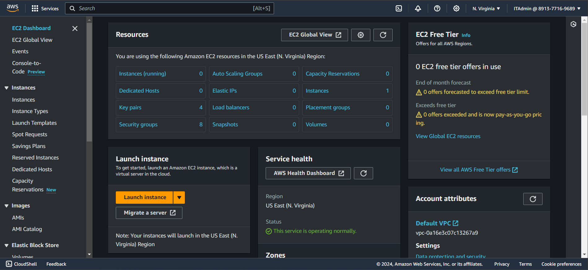
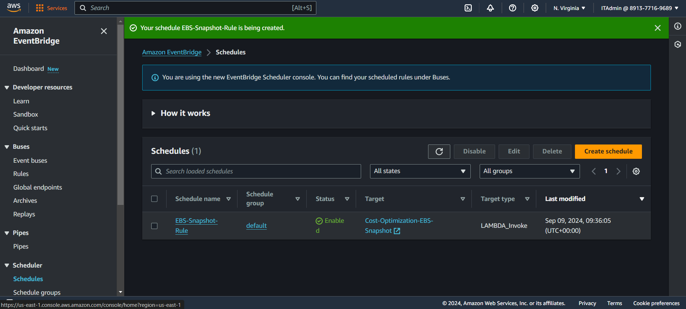

# AWS Cloud Cost Optimization - Identifying Stale EBS Snapshots

## Overview

This project focuses on optimizing AWS costs by identifying and deleting stale EBS snapshots that are no longer associated with any active EC2 instances. By removing these unused snapshots, we can save on storage costs. This guide will walk you through the entire process of setting up a Lambda function to achieve this.

## Prerequisites

1. **AWS Account**: You need an active AWS account.
2. **IAM Permissions**: Ensure you have permissions to create Lambda functions, IAM roles, and CloudWatch rules.
3. **Basic Knowledge**: Familiarity with Python boto 3, AWS Lambda, IAM roles, and EBS snapshots.

## Project Steps

### 1. Create EC2 Instance and Snapshot

1. **Launch an EC2 Instance**:
   - Navigate to the [EC2 Dashboard](https://console.aws.amazon.com/ec2).
   - Click on "Launch Instance".
   - Follow the steps to create an instance and note the instance ID.

2. **Create a Snapshot**:
   - Go to the [EC2 Dashboard](https://console.aws.amazon.com/ec2).
   - Select "Volumes" from the left sidebar.
   - Choose the volume attached to your EC2 instance and click on "Actions" > "Create Snapshot".
   - Provide a description and click "Create Snapshot".

   

### 2. Create Lambda Function and Add Python Code

1. **Create a Lambda Function**:
   - Navigate to the [Lambda Console](https://console.aws.amazon.com/lambda).
   - Click "Create function" and choose "Author from scratch".
   - Name the function (e.g., `DeleteStaleEBSnapshots`), choose Python as the runtime, and create a new role with basic Lambda permissions.

2. **Add Python Code**:
   - Replace the default code with the following Python script to identify and delete stale EBS snapshots:
(Python Script in the Folder 'EBS_Stale_Snapshots.py')

   

### 3. Grant Permissions for IAM Role

1. **Create or Modify IAM Role**:
   - Go to the [IAM Console](https://console.aws.amazon.com/iam).
   - Create a new role or modify an existing one to allow Lambda to interact with EC2.
   - Attach the following policies: `AmazonEC2ReadOnlyAccess` and `AmazonEC2FullAccess`.

   

### 4. Test Lambda Function

1. **Test the Lambda Function**:
   - Go to the Lambda Console.
   - Create a test event and invoke the function.
   - Check if the function successfully identifies and deletes stale snapshots.

   

### 5. Verify Deletion

1. **Verify Snapshot Deletion**:
   - After testing, go back to the [EC2 Snapshots Dashboard](https://console.aws.amazon.com/ec2/v2/home#Snapshots:).
   - Ensure that the stale snapshots have been removed.

   

### 6. Set Up CloudWatch Rule

1. **Create CloudWatch Rule**:
   - Go to the [CloudWatch Console](https://console.aws.amazon.com/cloudwatch).
   - Navigate to "Rules" and click "Create rule".
   - Choose "Event Source" and configure it to trigger your Lambda function on a scheduled basis (e.g., daily).

   

## Conclusion

By following these steps, you have successfully set up an automated system for identifying and deleting stale EBS snapshots, thereby optimizing your AWS costs. Regular monitoring and testing are recommended to ensure the process continues to run smoothly.

## Additional Resources

- [Boto3 Documentation](https://boto3.amazonaws.com/v1/documentation/api/latest/index.html)
- [AWS Lambda Documentation](https://docs.aws.amazon.com/lambda/latest/dg/welcome.html)
- [AWS EC2 Snapshots Documentation](https://docs.aws.amazon.com/AWSEC2/latest/UserGuide/snapshot-copy.html)
- [AWS IAM Roles Documentation](https://docs.aws.amazon.com/IAM/latest/UserGuide/id_roles.html)
- [AWS CloudWatch Documentation](https://docs.aws.amazon.com/AmazonCloudWatch/latest/monitoring/WhatIsCloudWatch.html)

## License

This project is licensed under the MIT License - see the [LICENSE](LICENSE) file for details.

